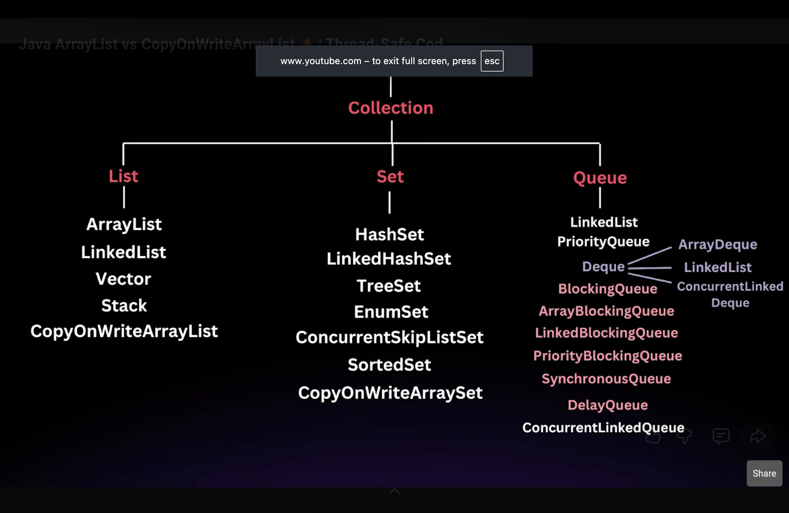

Collections API is Concept
Collection is a interface

Collection feature :

i.Dynamically in size 
ii.Store Same type or Different type elements based on implementation 
iii.Easy to use - with add(),remove(),clear
iv.efficent traversal : loops and iterators

